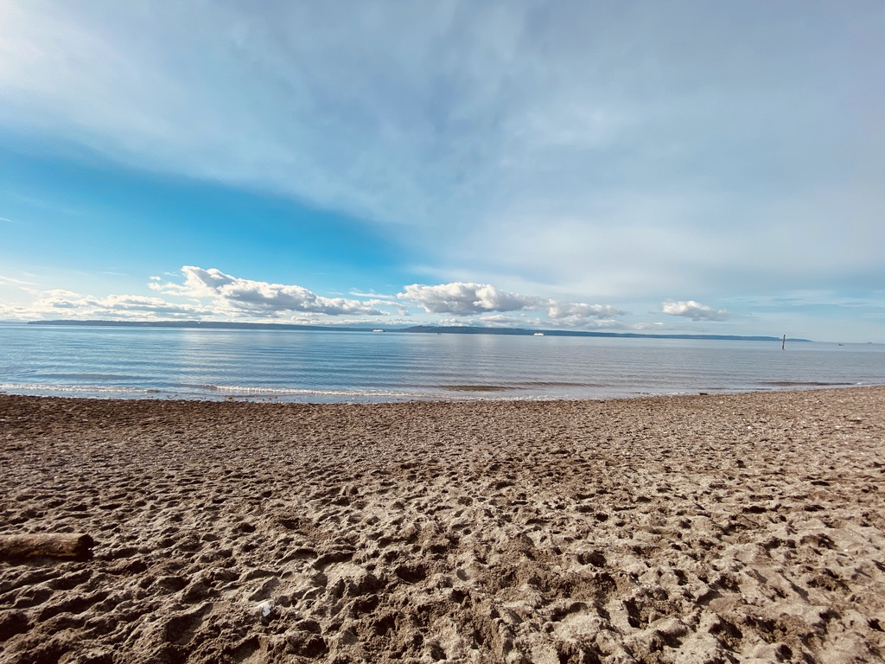

### Michelle Salazar 
*😄 Pronouns: she/her*
### Full Stack Software Developer
---
## Welcome to my GitHub!

Connect with me 

---
### My Journey

[Code Fellows](https://www.codefellows.org/) Advanced Software Development in Python **Jan 2022 - June 2022**

---
### Projects

---
### Recommended Learnings

---
### Learning Links
[freeCodeCamp](https://www.freecodecamp.org/news)

---
### CheatSheets to Live by

---
&copy;2022MISalz

<a target="_blank" href="https://icons8.com/icon/IXUU4h36YfmO/linkedin-circled">LinkedIn Circled</a> icon by <a target="_blank" href="https://icons8.com">Icons8</a>

<!--
**MISalz/MISalz** is a ✨ _special_ ✨ repository because its `README.md` (this file) appears on your GitHub profile.

Here are some ideas to get you started:

- 🔭 I’m currently working on ...
- 🌱 I’m currently learning ...
- 👯 I’m looking to collaborate on ...
- 🤔 I’m looking for help with ...
- 💬 Ask me about ...
- 📫 How to reach me: ...
- 😄 Pronouns: ...
- ⚡ Fun fact: ...
-->